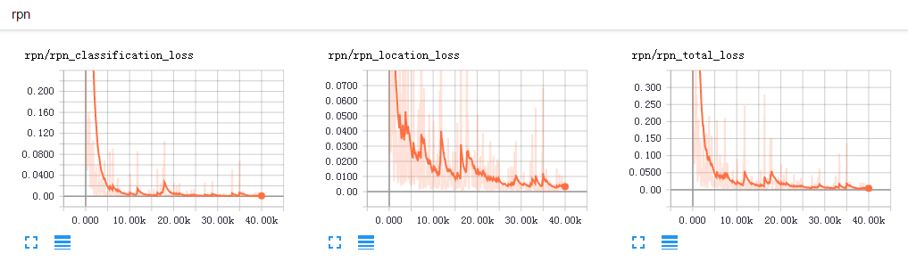
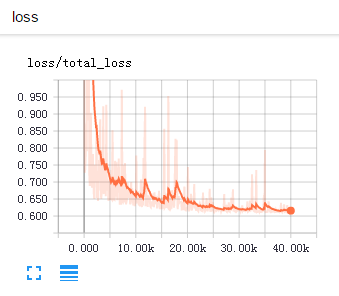
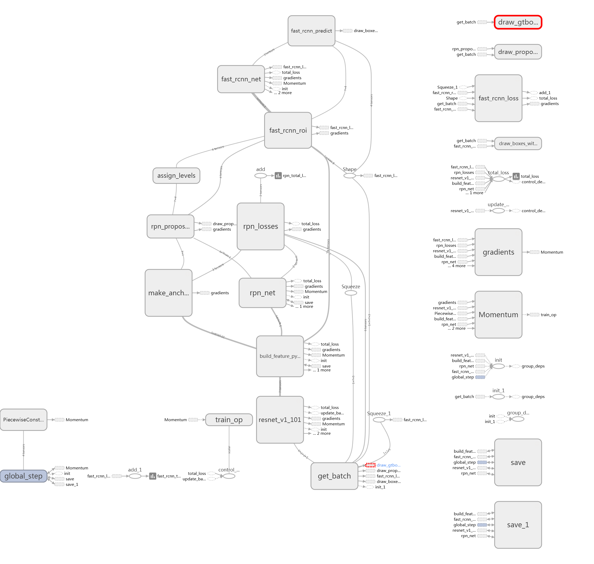
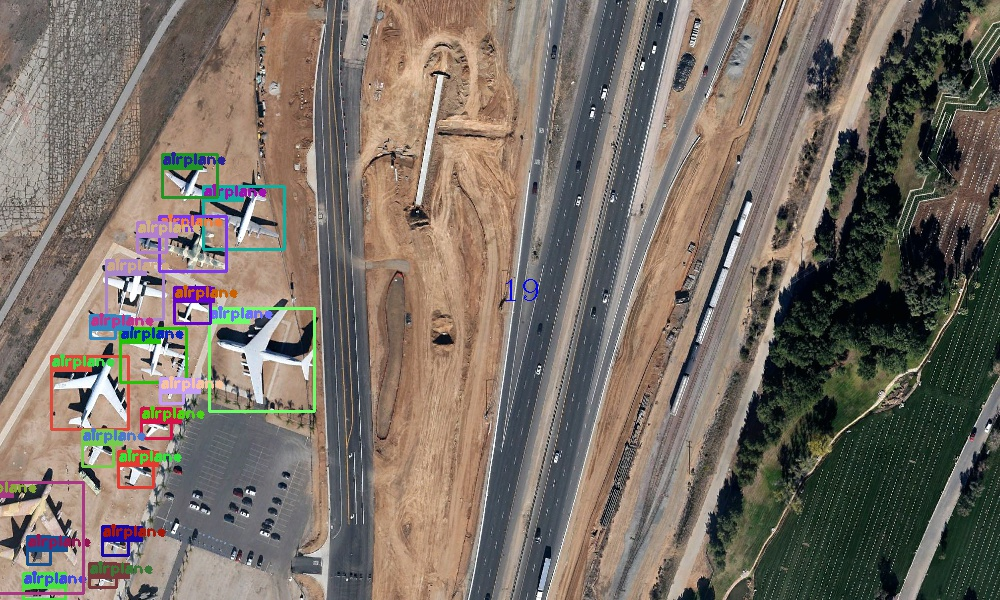
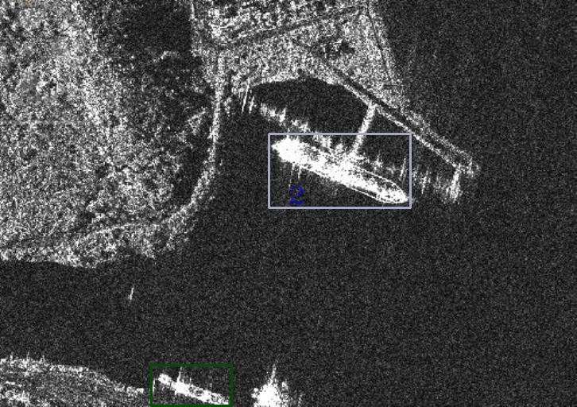
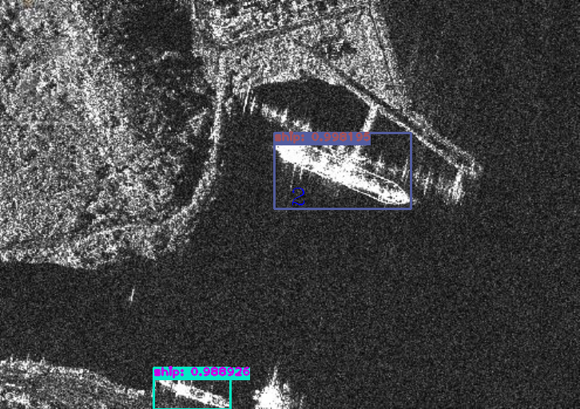

# Feature Pyramid Networks for Object Detection
A Tensorflow implementation of FPN detection framework.    
You can refer to the paper [Feature Pyramid Networks for Object Detection](https://arxiv.org/abs/1612.03144)    
Rotation detection method baesd on FPN reference [R2CNN](https://github.com/yangxue0827/R2CNN_FPN_Tensorflow) and [R2CNN_HEAD](https://github.com/yangxue0827/R2CNN_HEAD_FPN_Tensorflow) and [R-DFPN](https://github.com/yangxue0827/R-DFPN_FPN_Tensorflow)  
If useful to you, please star to support my work. Thanks.     

# Configuration Environment
ubuntu(Encoding problems may occur on windows) + python2 + tensorflow1.2 + cv2 + cuda8.0 + GeForce GTX 1080      
You can also use docker environment, command: docker push yangxue2docker/tensorflow3_gpu_cv2_sshd:v1.0     

# Installation    
  Clone the repository    
  ```Shell    
  git clone https://github.com/yangxue0827/FPN_Tensorflow.git    
  ```       

# Make tfrecord   
The image name is best in English.       
The data is VOC format, reference [here](sample.xml)     
data path format  ($FPN_ROOT/data/io/divide_data.py)      
VOCdevkit  
>VOCdevkit_train  
>>Annotation  
>>JPEGImages   

>VOCdevkit_test   
>>Annotation   
>>JPEGImages   

  ```Shell    
  cd $FPN_ROOT/data/io/  
  python convert_data_to_tfrecord.py --VOC_dir='***/VOCdevkit/VOCdevkit_train/' --save_name='train' --img_format='.jpg' --dataset='ship'
  ```

# Demo          
1、Unzip the weight $FPN_ROOT/output/res101_trained_weights/*.rar    
2、put images in $FPN_ROOT/tools/inference_image   
3、Configure parameters in $FPN_ROOT/libs/configs/cfgs.py and modify the project's root directory 
4、image slice           
  ```Shell    
  cd $FPN_ROOT/tools
  python inference.py   
  ```     
5、big image      
  ```Shell    
  cd $FPN_ROOT/tools
  python demo.py --src_folder=.\demo_src --des_folder=.\demo_des      
  ``` 

  
# Train
1、Modify $FPN_ROOT/libs/lable_name_dict/***_dict.py, corresponding to the number of categories in the configuration file    
2、download pretrain weight([resnet_v1_101_2016_08_28.tar.gz](http://download.tensorflow.org/models/resnet_v1_101_2016_08_28.tar.gz) or [resnet_v1_50_2016_08_28.tar.gz](http://download.tensorflow.org/models/resnet_v1_50_2016_08_28.tar.gz)) from [here](https://github.com/yangxue0827/models/tree/master/slim), then extract to folder $FPN_ROOT/data/pretrained_weights    
3、    
  ```Shell    
  cd $FPN_ROOT/tools
  python train.py 
  ``` 

# Test tfrecord     
  ```Shell    
  cd $FPN_ROOT/tools    
  python $FPN_ROOT/tools/test.py  
  ``` 

# eval   
  ```Shell    
  cd $FPN_ROOT/tools   
  python ship_eval.py
  ```  

# Summary   
  ```Shell    
  tensorboard --logdir=$FPN_ROOT/output/res101_summary/
  ```    
 
 
 

# Graph
 

# Test results    
## airplane
   
  
 
## sar_ship
   
  

## ship
    
      

# Note 
This code works better when detecting single targets, but not suitable for multi-target detection tasks. Hope you can help find bugs, thank you very much.    
    